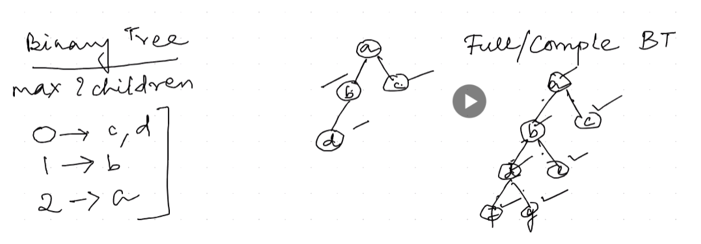
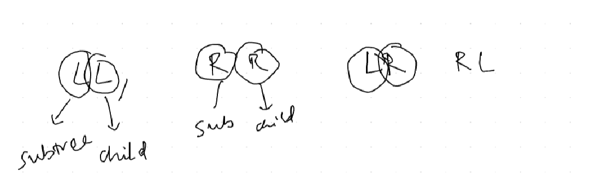

DAY-1 -> 
DAY-2
DAY3- Arrays started 
day6. Array sorting merging unsorted   unit-3  
Day-7 = 3.5 1.Merging two sorted arrays:; 2. Liner search unit 3
Day-8 =  section sort3.6

Day-9 = unit -3 stack stack in pop push after 2. Precendence chart important.https://www.geeksforgeeks.org/operator-precedence-and-associativity-in-c/ || 
Here is a table that shows the precedence of all of the operators in C:
|Operator|Precedence|
|:-|:-|
|()|High|
|^ (exponentiation)|High|
|* (multiplication)|Medium|
|/ (division)|Medium|
|% (modulus)|Medium|
|+ (addition)|Low|
|- (subtraction)|Low|
|= (assignment)|Low|

Day-10 =   thi$is postfix and algorythm   2,graph inside some topic , 
1.BFS Algorythm:  Breath first search,        BFS Traversel Algorythm.
2.DFS: Depth  first search                     DFS
one is level wise onother is depth wise.

Topic : HASH Function         lot of formula methods search on it

TOPIC : TREE
"TREE IS ALSO IS A DATASTRUCTURES BUT HIGH hiReTICAL MANNAER  " a is first start you cant go e directly 

----------------------------------------------------------------------------------------------------

Day-11 = Binary Tree 
1."Binary tree have maximum two childern or no child"
leaf notes rightside 

topic- BT- Balanace Binary tree  
A balanced binary tree, also known as a height-balanced binary tree. This is a binary tree in which the height of the left and right subtree of any node differ by not more than 1. This ensures that the tree remains relatively compact and that operations such as searching, insertion, and deletion can be performed efficiently.

One way to implement a balanced binary tree in C is to use an AVL tree. An AVL tree is a self-balancing binary search tree, which means that it automatically maintains its balance after each insertion or deletion operation.

2.Topic - Traversal ----------------------------

Pre-order traversal visits the root node first, followed by the left subtree and then the right subtree. This is typically used to print the nodes of a tree in a hierarchical order.

In-order traversal visits the left subtree first, followed by the root node and then the right subtree. This is typically used to print the nodes of a binary search tree in sorted order.

Post-order traversal visits the left subtree first, then the right subtree, and finally the root node. This is typically used to clean up after a tree traversal, such as deleting nodes or closing files.

Here is a table summarizing the three tree traversal algorithms:    

| Algorithm | Visit order |
|---|---|---|
| Pre-order | Root, left subtree, right subtree |
| In-order | Left subtree, root, right subtree |
| Post-order | Left subtree, right subtree, root |

 and combine images    
post-order and in order

3.Topic - binary search tree = 
A binary search tree (BST), which is a type of tree data structure where each node has a comparable key (and an associated value) and satisfies the restriction that the key in any node is larger than the keys in all nodes in that node's left subtree and smaller than the ones in its right subtree.

This means that the BST is always sorted in ascending order, making it very efficient for searching, insertion, and deletion operations.

BSTs are used in a wide variety of applications, including databases, search engines, and compiler optimizers.

Here is an example of a binary search tree:

     10
    /  \
   5   15
  / \  / \
 2   8 12  20

    Awesome topic created finally binary tree

4.topic - Binary Expression tree: creating
 combine 

For example, the following BET represents the expression a + b * c:

    +
   / \
  a   *
     / \
    b   c

""leaf note means there is no child ""--------------

5.topic = BINARY EXPRESSION EASY TO UNDERSTAND FIND THE LOWEST PRREDENCE -------
6. TOPIC = AVL TREE and (highed balance tree or balance  tree) 
lift - right that is balance factor  
 se3,
 
 ------------------------------------------------------
 ;

 Day-12  LL rotation
Here id unbslsnced 20-18-4 insert right side 0   

for Balancing Two rules it There 1. LL RR ONE RULE ROTAION 2.LR RL ROATION ONTHER RULE IS THERE  

1.LL/RR Interchangr node A and Pivot node
2.LR/RL Interchangr node A and B Pivot node
        Interchangr node B and A  Pivot node
LR/RL IS TWO STEP PROCESS 

Tree balancing 0 -1 2-1 3-1 =2 node this is unbalanced .

1.this balanced tree in LL rotation 
2. This Balanced tree in  RR rotation 

3.LR balance rotation  left subtree inserted in right means in  lift side tree to add right this is LR Rotation. once it is LR Rotation logic wase very difucult. firt we need to inter change node a to b after b to a.
.

Topic -2 = High Balance tree that means AVL Tree   AVL Tree
we can look at the balance factors (BF) of the nodes. The BF of a node is the difference between the heights of its left and right subtrees.

LL rotation: If the BF of a node is 2 and the BF of its left child is 1, then we perform an LL rotation. This rotation moves the left child up to be the parent of the node, and the node down to be the right child of its left child.
RR rotation: If the BF of a node is -2 and the BF of its right child is -1, then we perform an RR rotation. This rotation moves the right child up to be the parent of the node, and the node down to be the left child of its right child.
LR rotation: If the BF of a node is 2 and the BF of its left child is -1, then we perform an LR rotation. This rotation is a combination of an LL rotation and an RR rotation. First, we perform an LL rotation on the left child of the node. Then, we perform an RR rotation on the node.
RL rotation: If the BF of a node is -2 and the BF of its right child is 1, then we perform an RL rotation. This rotation is a combination of an RR rotation and an LL rotation. First, we perform an RR rotation on the right child of the node. Then, we perform an LL rotation on the node.
In the image, we can see that the following rotations need to be performed:

LL rotation at node 20: The BF of node 20 is 2 and the BF of its left child is 1.
RR rotation at node 60: The BF of node 60 is -2 and the BF of its right child is -1.
LR rotation at node 50: The BF of node 50 is 2 and the BF of its left child is -1.
After performing these rotations, the tree will be balanced.

Here is a more detailed explanation of each rotation:

LL rotation:

Before:

    50
   / \
  20   60
 / \
10  8

After:

    20
   / \
  10   50
       / \
      8   60
RR rotation:

Before:

   50
   / \
  20   60
       / \
      32   46

After:

    60
   / \
  50   46
 / \
20  32
LR rotation:

Before:

    50
   / \
  20   60
 / \   / \
10  8  32   46

After:

    32
   / \
  20   50
 / \   / \
10  8  46   60
RL rotation:

Before:

    50
   / \
  20   60
       / \
      46   32
     / \
    11   48

After:

    46
   / \
  32   50
 / \   / \
20  11  48   60

ppt 
PPT